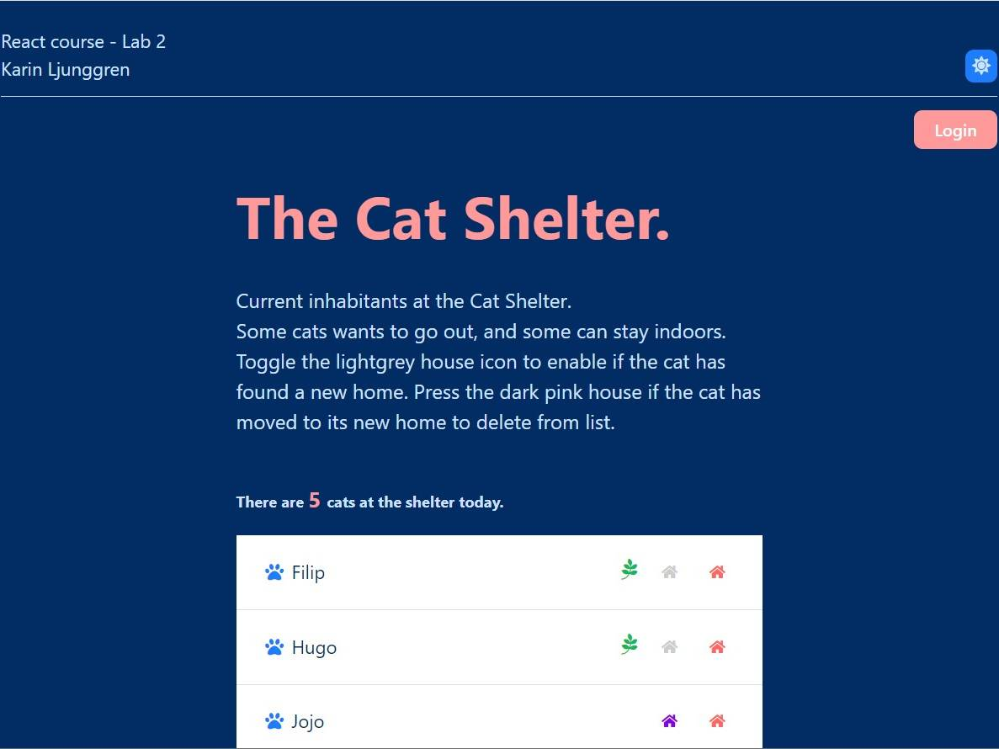

# Cat Shelter 2

## React course-Lab2

React project using the Vite tool.  
CRUD project adding cats to Cat Shelter list.  
Adding cat and choose if he needs to go outside or can be indoor cat.  
In list toggle if he found new home or not and delete if he has moved to the new home.

## Installation

To clone

`https://github.com/karinlj/react-course-lab2.git`

To install

`cd react-course-lab2`

`npm install`

To run

`npm run dev`

## Built With

- Vite
- React.js
- Scss
- Styled Components
- Fontawesome

## Author

- **Karin Ljunggren** - [karinlj](https://github.com/karinlj)

## License

This project is licensed under the MIT License - see the [LICENSE.md](LICENSE.md) file for details
